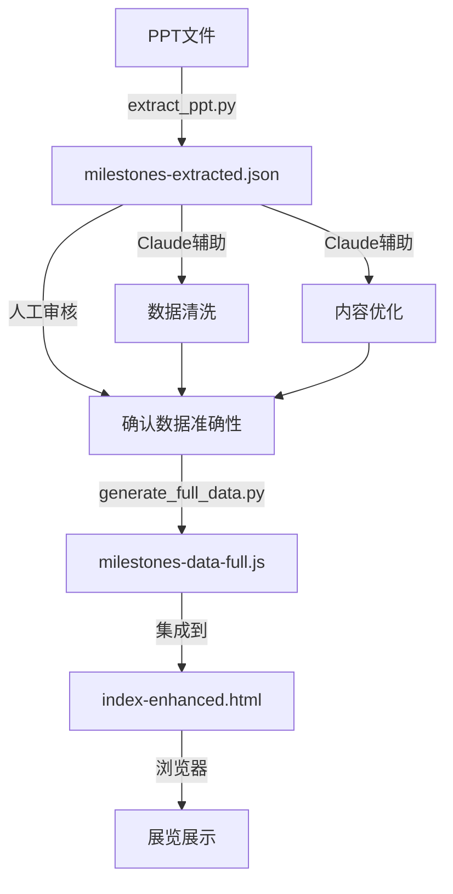

# Claude AI 协助指南

本文档记录如何使用Claude AI协助AI历史展览项目的开发、维护和扩展。

## 📋 目录

- [项目概览](#项目概览)
- [Claude的主要用途](#claude的主要用途)
- [常用提示词库](#常用提示词库)
- [数据处理工作流](#数据处理工作流)
- [内容优化建议](#内容优化建议)
- [故障排查](#故障排查)

---

## 项目概览

**项目名称**: AI-History-Show
**项目类型**: 交互式AI历史展览大屏应用
**技术栈**: HTML5 + CSS3 + Vanilla JavaScript + Three.js（3D地球）
**数据来源**: PowerPoint演示文稿 (`未来已来，过去未去 - 改.pptx`)
**里程碑数量**: 32个AI历史事件（1950-2025）
**主入口文件**: `index.html`（唯一版本，已集成所有功能）

---

## Claude的主要用途

### 1. 数据提取与处理

#### 从PPT提取内容
```prompt
我有一个关于AI历史的PPT文件，需要提取以下信息：
- 所有幻灯片的文字内容（标题、正文、备注）
- 嵌入的图片资源
- 保存为结构化JSON格式

请帮我编写Python脚本，使用python-pptx库完成提取。
```

#### 数据清洗与转换
```prompt
我有一个包含PPT原始数据的JSON文件（milestones-extracted.json），需要：
1. 过滤掉章节标题页（只包含分类信息，没有具体事件）
2. 提取关键字段：年份、标题、描述、人物、图片路径
3. 转换为前端可用的JavaScript数组格式
4. 自动简化超长标题（保持核心信息）

请帮我生成数据转换脚本。
```

### 2. 代码生成与优化

#### 生成HTML展示页面
```prompt
创建一个16:9的全屏HTML页面，用于展厅大屏展示AI历史里程碑：

要求：
- 深色主题，高对比度（适合远距离观看）
- 左侧：3D地球组件 + 地点信息
- 中间：年份、标题、描述、人物列表
- 右侧：拍立得风格照片拼贴（3张）
- 底部：评论视频播放器 + 导航按钮
- 支持键盘方向键切换页面
- 纯CSS实现，无外部依赖

请生成完整代码。
```

#### CSS效果优化
```prompt
优化现有的照片展示效果：

需求：
1. 拍立得相纸风格：白色边框，底部留白更宽（15%）
2. 随机旋转角度（-8° ~ 8°）
3. 悬停时放大1.15倍并上浮20px
4. 保持GPU加速（使用transform）

请更新CSS代码。
```

### 3. 内容创作与润色

#### 生成事件描述
```prompt
基于以下关键信息，生成一段150-200字的AI历史事件描述：

事件：AlexNet赢得ImageNet竞赛
年份：2012
人物：Alex Krizhevsky, Ilya Sutskever, Geoffrey Hinton
关键技术：深度卷积神经网络、ReLU激活函数、Dropout、GPU训练

要求：
- 突出历史意义
- 说明为何是转折点
- 提及技术创新点
- 适合展厅观众阅读（通俗易懂）
```

#### 标题简化
```prompt
以下标题过长，需要简化为20字以内，保留核心信息：

原标题："2012-2014年，获得ImageNet冠军的AlexNet、VGG、GoogleNet，每年都在刷新人们对深度学习的认知"

请提供3个简化版本供选择。
```

### 4. 文档撰写

#### 生成分析报告
```prompt
基于提取的PPT数据（milestones-extracted.json），生成一份详细的内容分析报告：

包含：
1. 提取统计（幻灯片数、图片数、事件数、时间跨度）
2. AI历史分类结构（按时代划分）
3. 核心主题提炼
4. 推荐的展览里程碑（必选和可选）
5. 下一步建议

保存为Markdown格式。
```

---

## 常用提示词库

### 数据相关

#### 验证数据完整性
```prompt
检查milestones-data-full.js中所有里程碑数据，验证：
1. 必填字段是否完整（id, year, title, category）
2. 图片路径是否有效
3. 地理坐标格式是否正确 [lat, lng]
4. 是否有重复的ID

列出所有问题和建议。
```

#### 补充缺失数据
```prompt
以下里程碑缺少地理位置信息，请帮我补充：

事件：LSTM发明
年份：1997
人物：Sepp Hochreiter, Jürgen Schmidhuber

请提供：
1. 发生地点名称
2. 国家/地区
3. GPS坐标 [纬度, 经度]
4. 地点历史背景（1-2句）
```

### 代码相关

#### 添加新功能
```prompt
在index.html中添加时间轴导航功能：

需求：
- 顶部横向时间轴（1950-2025）
- 标记所有32个里程碑的年份
- 点击年份跳转到对应页面
- 当前页面高亮显示
- 响应式设计（使用vw单位）

请提供HTML、CSS和JavaScript代码。
```

#### 性能优化
```prompt
分析index.html的性能瓶颈，提供优化建议：

关注点：
1. 图片加载优化（懒加载、预加载）
2. Three.js 3D地球渲染性能
3. 动画性能（避免重排）
4. JavaScript执行效率
5. CSS渲染性能

请给出具体代码改进方案。
```

### 内容相关

#### 多语言支持
```prompt
将milestones-data-full.js中的所有中文内容翻译为英文，保持：

1. 原有的JSON结构
2. 技术术语的准确性
3. 描述的完整性
4. 引用格式

生成milestones-data-full-en.js。
```

#### SEO优化
```prompt
为index-enhanced.html添加SEO优化元素：

需要：
1. 合适的meta标签（description, keywords, og:标签）
2. 结构化数据（JSON-LD格式，标记历史事件）
3. 语义化HTML改进建议

请提供代码。
```

---

## 数据处理工作流

### 完整流程



### 使用Claude的步骤

#### Step 1: 提取数据
```bash
# 运行提取脚本
python3 extract_ppt.py

# 让Claude分析输出
```
```prompt
分析milestones-extracted.json，总结：
1. 提取了多少张幻灯片
2. 识别了哪些关键事件
3. 图片资源的分布情况
4. 数据质量问题
```

#### Step 2: 清洗数据
```prompt
从milestones-extracted.json中识别并过滤掉章节标题页。

章节标题页特征：
- 标题包含"年事件"、"历史回响"等关键词
- 正文内容少于50字
- 只有分类信息，没有具体事件

请列出应该保留的幻灯片编号。
```

#### Step 3: 转换格式
```prompt
将筛选后的数据转换为JavaScript数组格式：

输入：milestones-extracted.json（已清洗）
输出：milestones-data-full.js

字段映射：
- slide.title → title
- slide.year → year（从内容中提取）
- slide.body → description
- slide.images → photos（转为相对路径）

请生成完整代码。
```

#### Step 4: 内容优化
```prompt
优化所有事件描述，使其：
1. 长度控制在150-250字
2. 突出历史意义
3. 包含技术亮点
4. 语言通俗易懂
5. 适合展厅观众阅读

批量处理milestones-data-full.js中的所有描述。
```

#### Step 5: 验证与测试
```prompt
生成一个验证脚本（validate_data.js），检查：

1. 所有必填字段是否存在
2. 年份范围是否合理（1950-2025）
3. 图片路径是否有效（检查文件存在）
4. GPS坐标格式是否正确
5. 是否有重复ID

输出详细的验证报告。
```

---

## 内容优化建议

### 使用Claude改进描述文字

#### 提升可读性
```prompt
以下描述过于学术化，请改写为展厅观众能理解的版本：

原文："反向传播算法通过链式法则计算损失函数对网络参数的梯度，并使用梯度下降法更新权重，从而实现多层神经网络的有效训练。"

要求：
- 使用类比或比喻
- 避免专业术语
- 突出实际意义
- 保持准确性
```

#### 增加故事性
```prompt
将以下历史事件改写为更具故事性的叙述：

事件：1956年达特茅斯会议
现有描述：1956年夏天，麦卡锡、闵斯基等人在达特茅斯学院召开会议，首次提出"人工智能"术语，标志着AI领域的正式诞生。

要求：
- 添加场景描述
- 突出戏剧性时刻
- 保留历史准确性
- 长度200字左右
```

### 生成补充内容

#### 人物简介
```prompt
为以下人物生成简短介绍（50字以内）：

姓名：Geoffrey Hinton
角色：深度学习先驱

要求：
- 突出主要贡献
- 提及关键成就
- 适合卡片展示
```

#### 技术解释
```prompt
用通俗语言解释以下技术概念（100字左右）：

概念：Transformer架构的自注意力机制

要求：
- 避免数学公式
- 使用日常类比
- 说明为何重要
- 适合非技术观众
```

---

## 故障排查

### 使用Claude诊断问题

#### 前端显示问题
```prompt
index.html在展示时出现以下问题：

现象：拍立得照片不显示
浏览器：Chrome 120
控制台错误：[具体错误信息]

已检查：
- 图片路径正确
- CSS样式已加载
- JavaScript无报错

请帮我诊断可能的原因并提供解决方案。
```

#### 数据加载问题
```prompt
milestones-data-full.js加载后，只显示前3个事件，其余无法显示。

代码片段：
[粘贴相关JavaScript代码]

请分析问题并提供修复方案。
```

#### 兼容性问题
```prompt
展览页面在Safari浏览器上显示异常：
- 3D地球（Three.js）不渲染
- 拍立得照片旋转角度不生效

请提供Safari兼容性修复方案。
```

#### Three.js 地球问题
```prompt
index.html中的Three.js 3D地球出现以下问题：

现象：[描述问题，例如地球不显示/纹理加载失败/旋转异常]
控制台错误：[具体错误]

地球初始化函数在 initGlobe()，渲染循环在 animateGlobe()。
相机采用绕球飞行方式（camCurrent/camTarget），地球本身不旋转。

请帮我排查并修复。
```

### 调试技巧

#### 生成调试代码
```prompt
为index-enhanced.html添加调试功能：

需求：
1. 在页面上显示当前里程碑ID
2. 在控制台输出导航事件
3. 验证数据加载状态
4. 检查图片资源是否成功加载

请提供JavaScript代码。
```

#### 性能分析
```prompt
分析index-enhanced.html的性能指标：

使用Chrome DevTools的Performance面板，关注：
1. 首屏加载时间
2. 页面切换响应时间
3. 动画帧率（是否保持60fps）
4. 内存使用情况

请根据[粘贴性能报告截图]提供优化建议。
```

---

## 未来扩展建议

### 使用Claude规划新功能

#### 功能设计
```prompt
为AI历史展览系统设计一个"时间旅行"交互功能：

需求：
1. 用户可以拖动时间轴快速浏览
2. 自动播放模式（每页停留10秒）
3. 按时间段筛选（1950s, 1980s, 2010s...）
4. 搜索功能（按关键词、人物）

请提供：
- 功能详细设计
- 技术实现方案
- UI/UX建议
- 代码框架
```

#### AI集成
```prompt
在展览系统中集成AI助手，允许观众提问：

需求：
1. 观众可以询问任何AI历史问题
2. 基于milestones数据回答
3. 可以推荐相关里程碑
4. 语音输入支持

技术选择：
- 使用Claude API
- 或集成本地AI模型

请提供实现方案和示例代码。
```

### 内容扩展

#### 添加新时代
```prompt
2026-2030年预计会有哪些重要的AI里程碑？

基于当前趋势，预测并生成5个未来事件（用于展览的"未来展望"区）：

格式：
- 年份
- 事件标题
- 技术描述
- 可能的影响
- 相关机构

请保持与现有数据风格一致。
```

---

## 最佳实践

### 与Claude协作的技巧

1. **提供充足上下文**
   - 分享完整的文件路径
   - 说明项目结构
   - 附上相关代码片段

2. **明确具体需求**
   - 列出详细要求
   - 提供示例输出
   - 说明约束条件

3. **迭代优化**
   - 先生成MVP版本
   - 逐步完善细节
   - 及时反馈问题

4. **验证输出**
   - 测试生成的代码
   - 审核生成的内容
   - 检查数据准确性

5. **保存提示词**
   - 记录有效的提示词
   - 建立提示词库
   - 持续优化模板

---

## 附录

### 项目文件清单

```
AI-History-Show/
├── index.html                   # ⭐ 主入口（唯一版本，含全部功能）
├── milestones-data-full.js      # 完整数据（32个里程碑）
│
├── resources/
│   ├── images/                  # 里程碑历史图片（73张）
│   │   ├── 1956-dartmouth/
│   │   ├── 1957-perceptron/
│   │   └── ...（按年份-事件命名）
│   └── videos/                  # 视频元数据（18个JSON）
│
├── vendor/                      # 本地依赖（离线部署用）
│   └── three.min.js             # Three.js（可选，默认从CDN加载）
│
├── README.md                    # 项目说明
├── DEPLOYMENT.md                # ⭐ 部署指南（Nginx / Gitee Pages）
└── claude.md                    # 本文档
```

> **注意**：`vendor/` 目录仅在内网/离线部署时需要，参见 [DEPLOYMENT.md](DEPLOYMENT.md)。

### 关键技术说明

#### Three.js 3D 地球

- 相机绕地球飞行（`camCurrent` / `camTarget`），地球本身不旋转
- 页面切换时相机平滑飞向目标经纬度，到位后红色标记点闪烁2次后常亮
- 纹理来自 CDN：`unpkg.com/three-globe/example/img/earth-blue-marble.jpg`
- 离线部署需将纹理和 Three.js 都下载到本地

#### 坐标系约定

```javascript
// 经纬度 → 相机角度
phi   = (90 - lat) * (Math.PI / 180)   // 极角，Y轴向上
theta = -lng * (Math.PI / 180)          // 方位角

// 经纬度 → 球面坐标（标记点局部坐标）
x = r * sin(phi) * sin(theta)
y = r * cos(phi)
z = r * sin(phi) * cos(theta)
```

#### 数据格式

每个里程碑的 `location` 字段格式：

```json
{
  "name": "地点名称",
  "country": "国家/地区",
  "coordinates": [纬度, 经度]
}
```

坐标 `[0, 0]` 为无效占位符，会被自动跳过，不触发地球旋转。

---

### 相关资源

- **Claude官方文档**: https://docs.anthropic.com/
- **Three.js文档**: https://threejs.org/docs/
- **部署指南**: [DEPLOYMENT.md](DEPLOYMENT.md)

---

**文档版本**: 2.0
**创建时间**: 2026-03-12
**最后更新**: 2026-03-16
**维护者**: [项目团队]

**使用建议**: 本文档是活文档，随着项目发展持续更新。欢迎补充新的提示词和最佳实践。
