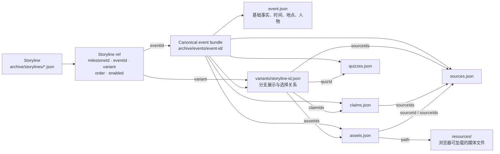
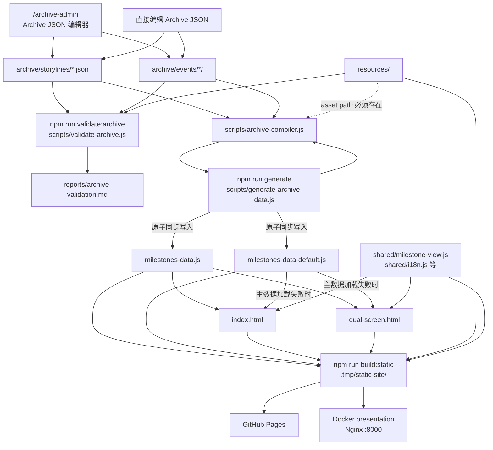
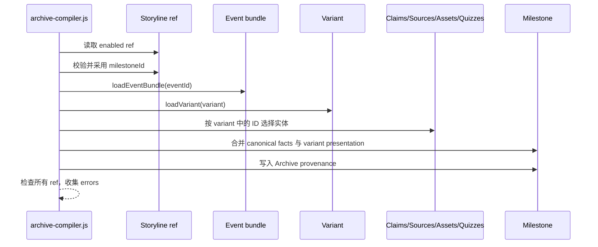
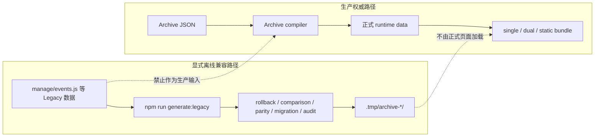
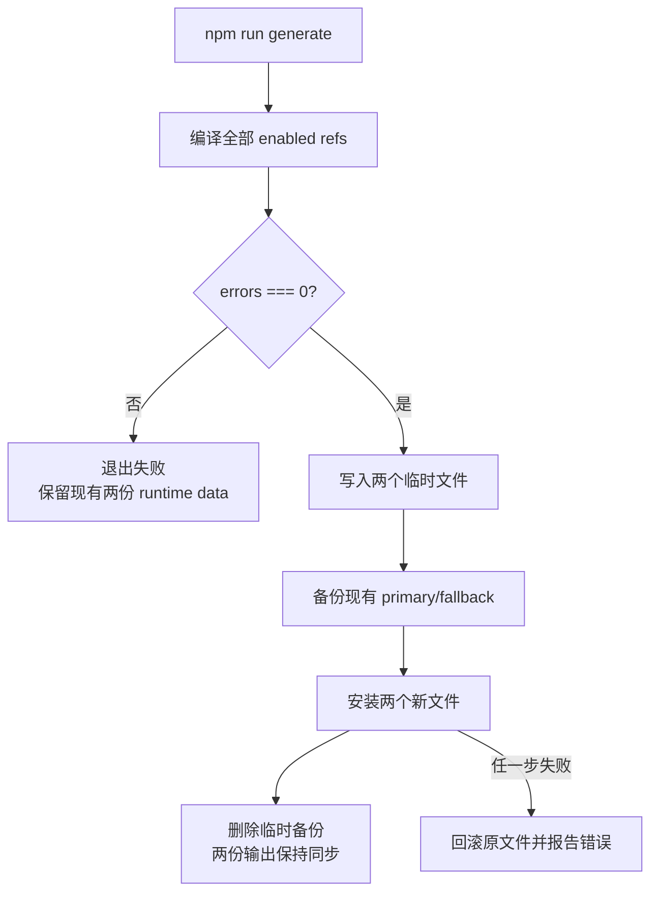

# Archive 数据流与内容权威边界

> 当前状态：2026-07-17。本文描述当前生产链路；迁移期的 overlay、preview 和 Legacy-first 流程仅作为离线比较或历史记录保留。

## 1. 内容实体关系



核心规则：

- Event 是 canonical 事实主体，同一事件只维护一次基础事实。
- Storyline ref 拥有正式展示 ID `milestoneId`、事件引用、variant、顺序与启用状态。
- Variant 选择该分支使用的 claim、source、asset、quiz，并承载分支特定的展示字段。
- `archive/` 保存元数据、来源、关系和审核状态；`resources/` 保存实际文件。
- 前端不直接读取 `archive/`，而是读取编译后的 runtime data。

## 2. 从编辑到部署的生产数据流



推荐编辑顺序：

```bash
npm run start:admin       # 打开 http://localhost:3001/archive-admin
npm run validate:archive
npm run generate
npm run quality
```

涉及部署时继续运行：

```bash
npm run validate:deployment
```

## 3. 单个 milestone 的编译展开



生成的 milestone 保持现有前端 shape，主要包含：

- `id`、`year`、`date`、`title`、`description`、`location`；
- `figures`、`resources.images/videos`、`imageMeta`；
- `achievement.sources/claims/visualModules`；
- `commentarySections`、`analysis`、`quizzes`；
- `archiveEventId`、`archiveVariantId`、`sourceKind: "archive"` 等 provenance。

当前 production compiler 不使用 Legacy milestone 作为 scaffold，也不从 Legacy fusion metadata 推导正式 milestone ID。

## 4. Production 与 Legacy 隔离边界



边界约束：

- 默认 `npm run generate` 只编译 Archive storyline 和 event bundle。
- `/archive-admin` 是可写内容入口；`/admin` 是 Legacy 只读参考页。
- Legacy mutation API 在 authority cutover 后返回 HTTP 403。
- `npm run generate:legacy` 可能临时覆盖两份 runtime data；比较结束后必须重新运行 `npm run generate`。
- preview、native、parity、review 和机器报告工作集写入被忽略的 `.tmp/archive-*`，不会进入 Pages/Docker 静态包。

## 5. 失败保护与生成物规则



以下文件是生成物，不得手工编辑：

```text
milestones-data.js
milestones-data-default.js
.tmp/archive-*/**
```

版本库中的产物分层：

| 层级 | 位置 | 策略 |
|---|---|---|
| 内容权威 | `archive/**` | 长期跟踪，人工编辑入口 |
| 正式 runtime | `milestones-data*.js` | 长期跟踪，只能由 generator 更新 |
| 当前摘要报告 | `reports/*.md` | 按命令刷新，保留长期可读结论 |
| 机器工作集 | `.tmp/archive-reports/`、`.tmp/archive-review/` 等 | 可重建，不跟踪 |
| 阶段历史 | `reports/history/` | 保留迁移计划、基线与阶段验收背景 |

`resources/` 继续按 append-only 规则管理。资源报告中的“未引用”只表示没有找到某类静态引用，不构成删除授权。

## 6. 关键实现入口

- `scripts/archive-compiler.js`：加载 storyline、event bundle、variant，并生成 milestone。
- `scripts/generate-archive-data.js`：处理编译错误和两份 runtime data 的原子同步写入。
- `scripts/validate-archive.js`：验证结构、引用、双语字段和资源路径。
- `manage/archive-admin.html`、`manage/server.js`：Archive JSON 编辑、保存和校验 API。
- `scripts/test-archive-authority.js`：固定 Archive authority、稳定 ID、provenance 和输出保护边界。
- `scripts/build-static-site.js`：构建 Pages 与 Docker 共用的最小静态发布包。
